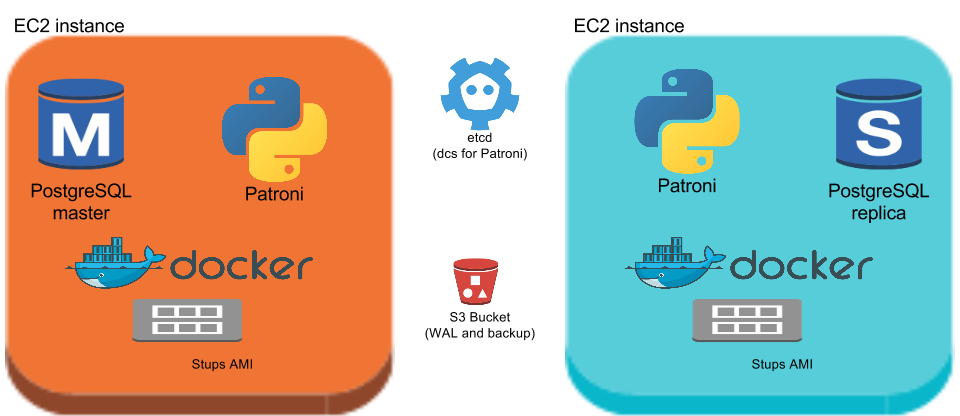
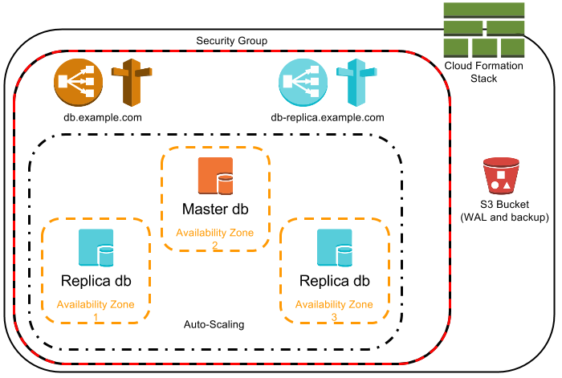

Spilo combines Patroni with the Stups infrastructure. Its major components are:

* [Patroni](https://github.com/zalando/patroni)
* [Stups](https://stups.io)

## Patroni
Patroni manages the [PostgreSQL](https://www.postgresql.org) databases which are running in a Spilo. It ensures
there is at most 1 master within Spilo.

To allow distributed nodes to agree on anything, we need a Distributed Configuration Store (DCS).
Patroni can utilize [etcd](https://coreos.com/etcd/) and [ZooKeeper](https://zookeeper.apache.org/).

**Etcd**

Most deployments of Patroni use etcd. Etcd implements the Raft protocol. Explaining the details of
the concencus algorithm of raft is outside the scope of this document.
For more information, check the following interactive
websites:

* Introduction into raft [http://thesecretlivesofdata.com/raft/](http://thesecretlivesofdata.com/raft/)
* Interactive raft visualization [https://raft.github.io](https://raft.github.io)

## Stups
Stups allows us to run PostgreSQL on top of Amazon Web Services (AWS) in an audit-compliant manner.
It requires us to use the [Taupage AMI](https://github.com/zalando-stups/taupage) and [Docker](https://docs.docker.com).

**2 node Spilo**

## Amazon Web Services
Running Spilo on [AWS](https://aws.amazon.com/) allows us to address issues like node replacement, connectivity, external backups. We use the following components:

* CF (Cloud Formation)
* ASG (Auto Scaling Groups)
* ELB (Elastic Load Balancing)
* Route 53
* S3 (Simple Storage Service)
* SG (Security Group)
* KMS (Key Management Service)

**3 node Spilo**

**Auto Scaling**

The Auto Scaling ensures a new EC2 instance will run if a node fails. The Launch Configuration of the ASG has enough configuration for Patroni to discover the correct Patroni siblings.
The ASG will also ensure nodes are running in different Availability Zones.

**Elastic Load Balancing and Route 53**

To allow applications to connect to the database using a dns name, we use a Route 53 (dns) CNAME
which points to an ELB. This ELB will only route connections to the master and not to the replicas.

A replica ELB is optionally available, it only routes connections to the replicas, never to the master.

**S3**

Binary backups are created periodically and are shipped to S3. WAL files generated by the master are also archived to S3.
This allows Point-in-time recovery abilities.

Having backups in S3 also allows new nodes to be restored from S3 (instead from the master). This may speed up spawning a new node and
reduce pressure on the master.

**Security Groups**

Multiple Security Groups are created, one for the EC2 instances, which is by default restrictive:

* Allows Spilo peers to connect to eachother
* Allows ELB's to connect to the EC2 instances
* Allows administrative and monitoring connections to the instances

And a Security Group per ELB, to allow access to specific networks or applications, which by default allows traffic from this VPC's region.

**Cloud Formation**

All components are described in a Cloud Formation Template. The stups tool [senza](https://github.com/zalando-stups/senza)
greatly simplifies generating this template.
